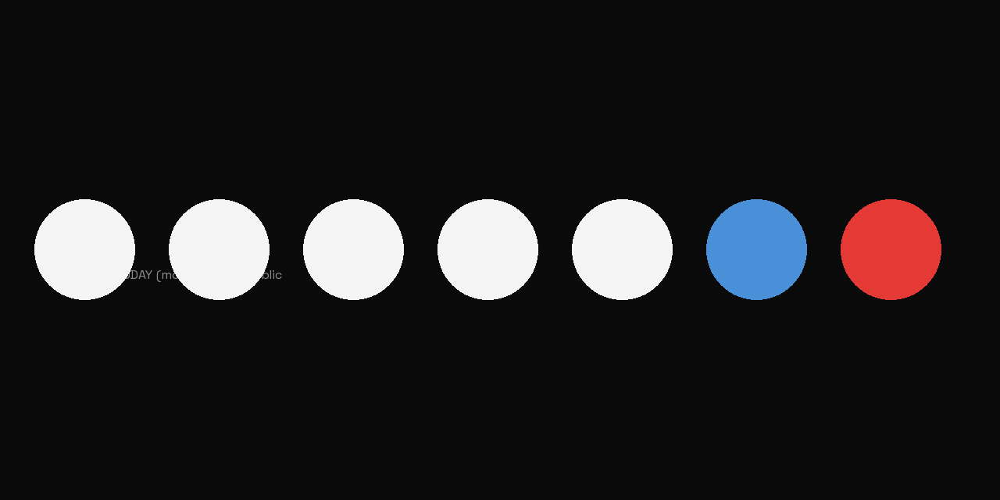

# moday-devlog

> Building **MODAY** ([moday.me](https://moday.me)) in public — day-of-the-week T-shirts for engineers and geeks, shipped globally on-demand.

This repository is the source of truth for MODAY's construction blog. Articles are written here in Markdown, then cross-posted to:

- [Shopify Blog (Journal / Engineering)](https://moday.me/blogs/) — primary canonical
- [dev.to / @yoskee](https://dev.to/yoskee)
- [Hashnode / @yoskee](https://hashnode.com/@yoskee)
- [Qiita / @yoskee](https://qiita.com/yoskee) (JA)
- [Zenn / @yoskee](https://zenn.dev/yoskee) (JA)
- [note / @moday_official](https://note.com/moday_official) (JA, manual)
- [Medium / @moday-official](https://medium.com/@moday-official) (EN, manual)
- [Tumblr](https://moday-official.tumblr.com)

## Tech stack

- Storefront: Shopify (Dawn theme)
- Print-on-demand: Gelato (geo-routed)
- Translation: Shopify Translate & Adapt (9 languages)
- Automation: Make.com
- Webhook server: FastAPI on Render.com
- Distribution: this repo → Make.com fan-out → 7 platforms

## About the author

MODAY is built solo by [Yoskee](https://github.com/sekiyosuke97). Engineering articles get posted under the `yoskee` handle across technical platforms; this account is the GitHub backstage.

## License

Articles in `posts/` are released under [CC BY 4.0](https://creativecommons.org/licenses/by/4.0/). Code snippets and supporting scripts are MIT-licensed (see [LICENSE](LICENSE)).
